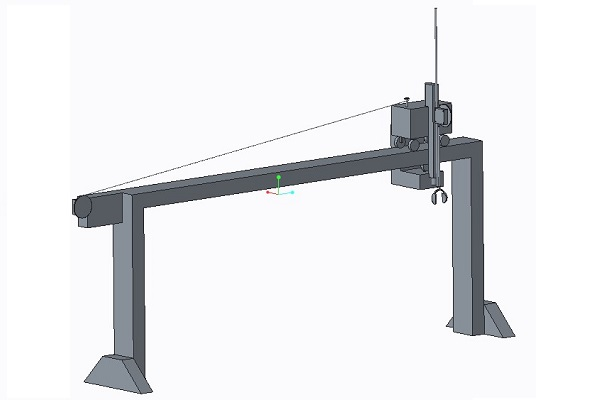

## Problem

For this school project, students were divided into groups and were given a task; to move an uncooked egg from one solo-cup filled with water to an empty solo-cup three feet away. We were not allowed to start within a 2ft x 2ft x 1ft boundary of the first cup, and had to complete the objective within 60 seconds, while spilling as little water as possible. The device used to do this must be fully automated and powered by a maximum 12 volt source.

## Solution

My group decided to build a gantry-crane, making it easier to work within each axis. We initially began above the cup, but the linear actuator used was very slow, so decided to start 1 ft to the side of the cup, which saved us about 9 seconds. In the end we completed the task in 50 seconds without spilling any water. The video shows our first iteration with the claw starting above, and the model shows the changes made (unfortunately there was no video footage of this).

