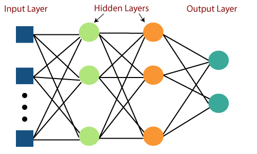

During my final year at Carleton University I conducted rearch under Professor Alex Ellery. His focus was on space robotics and micro-rover development. The goal of my research was to develop a low cost, material restricted computer to perform navigation.

Rather than constructing traditional CPU-based architectures with bulky vacuum tubes, more compact neural network circuits based on analog neurons was proposed. Neural networks are Turing-complete as they are able to recognize or decide data-manipulation rule sets. In order to explore this possibility, a series of analog neural networks are characterized to implement rover navigation and demonstrate such circuits conducting a sophisticated task central to the realization of self-sufficient in-situ resource utilization.

You can read the report <a href="/DirectedStudiesFinalReport.pdf" target="_blank">here.</a> The final report published by Professor Ellery can be found <a href="https://carleton.ca/ceser/wp-content/uploads/ISRU-Neural-Computing.pdf" target="_blank">here.</a>
