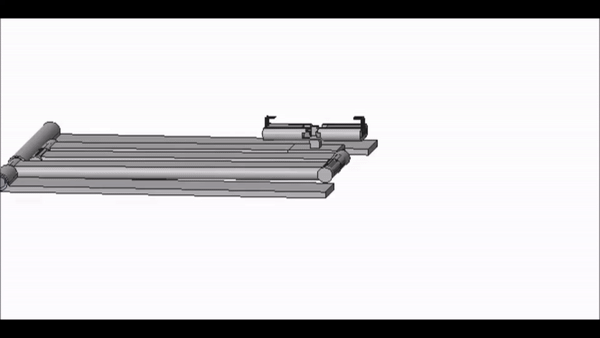

While I was a student, I preferred to use my laptop while in bed. Throughout university I would prop my laptop up on a small table and place it over myself in bed to watch movies, do homework and surf the web. However this became increasingly uncomfortable and I often felt the need to adjust the position of my laptop. At the end of first year university I decided to apply some of the CAD modelling skills I learnt, and I designed a laptop stand.

I didn't want this to just be a table I place over myself, I wanted it to be unique and fully adjustable. After drawing out a few designs and jotting down some requirements I settled on the design shown.

It allows the user to fold out the stand from the side or underneath of their bed and adjust the arms to a comfortable height. It also allows for books or tablets to be used instead of a laptop. I have often thought about adding lights on the side to illuminate the keyboard of a laptop or the pages of a book, and will probably opt to do this once the stand is fully built. My favorite part though is the button mechanism used to adjust the arm positions.
