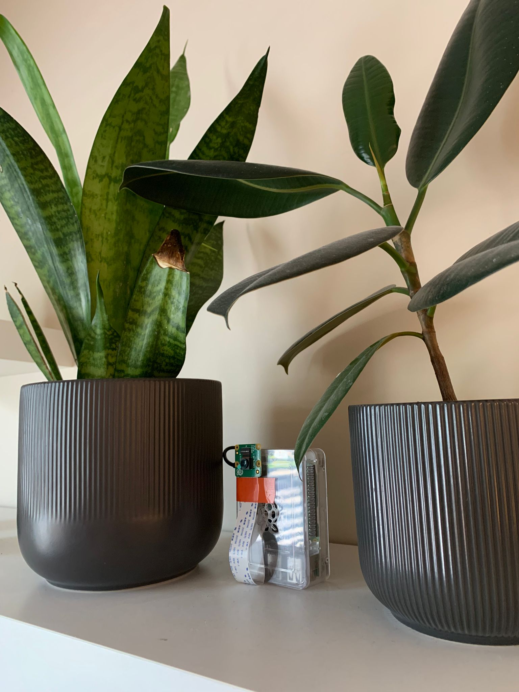

## Motion Detection

Created a security camera to detect and log events. Using opencv I created a background mask of the initial frame capture. If the mask changes by a certain percentage it is assumed there is motion in the video feed. During this time the feed is recorded and saved to device. A buffer of 10 saved videos is used until there is a rollover, deleting the oldest one.

## Website and Live Stream

The feed and logs are accessible from a website hosted on a raspberry pi which also acts as the security camera. Using v4l2loopback I create a virtual video device which receives the livestream. This virtual video device is encoded in the H264 format is then read using ffmpeg. Ffmpeg converts the video stream into a mpeg dash feed which is then posted on the websites homepage.

All the source code can be found on my <a href="https://github.com/LiamGritters/RaspberryPiSecurityCamera" target="_blank">github.</a>
