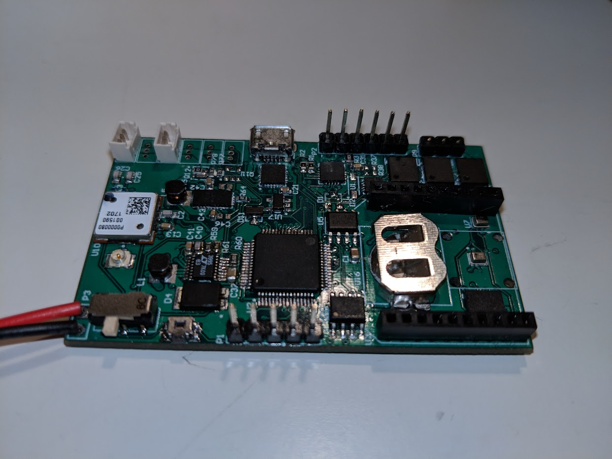

## Inspiration

Inbetween my 3rd and 4th year of university while I was working for 16 months at Provectus Robotics as a Co-op student I remained involved in the Robotics Club. However the club didn't have a main project to focus on and decided to reach out to the CU-inSpace club to assist with their project. It was a perfect pairing as they were working on a rocket to launch that summer but had no payload to fill out. We came up with a few ideas but landed on building a glider to collect atmospheric data on its descent.

## Implementation

We were responsible for building and designing the glider and its release mechanism. Our team was made up of only 3 students for the whole electrical and software component of the payload. The glider control unit was designed from scratch using Altium Designer, you can see the final PCB below. A GPS and altimeter were integrated into the board to measure the gliders position and altitude. As part of the competetion the glider and rocket had to rely its position back to a base station. A barometer was also intergrated to collect pressure data.

A seperate PCB was built for the release mechanism. It was a simple design that would activate at the rockets peak altitude which was determined by the onboard altimeter. The mechanism consisted of a resistor that would heat up and melt a fishing line that was holding the nose cone together. Once severed a parachute attached to the rocket was deployed and forced the separation of the payload from the rockets base.
